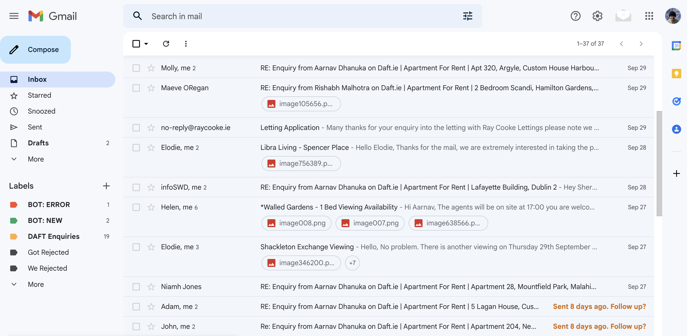
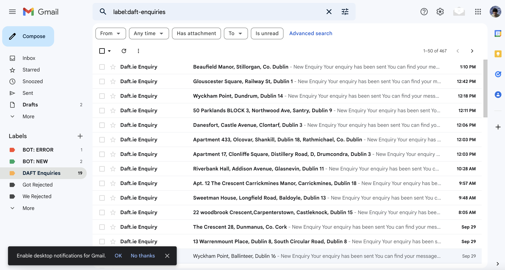

<p align="center">
    
  </a>
  <strong>
    <h3 align="center" >DAFT BOT</h3>
  </strong>
</p>


> AutoMagically apply to new listings on daft based on the filter you specify.
> 


A housing crisis in Dublin has made finding an house could be extremely hard, this bot is suppose to automate most of the tedious steps, and hopefully help you find a house


| Response | Enquiries |
|---|---|
|||


## Development setup

Follow the steps to setup the project

## Prerequisites

Install Python3 from [here](https://www.python.org/downloads/)

Make sure you have  > python 3.11 Installed

## Installation

``` python
 pip install -r requirements.txt
```

Run the script

``` sh
 sh script.sh
```

If you want to run the script priodically every 1 minute, you need to run a cron job to run the `sh script.sh` command, what I recommend is to setup an EC2 instance on AWS (I work at AWS :P) or use a droplet on digital ocean. 

``` sh
crontab -e

*/1 * * * * sh ~/daft-bot/script.sh
# SPECIFY THE LOCATION OF THE SCRIPT 
```


1. Make sure you have Python3 installed
2. Have the correct version of selenium driver for Chrome. [Link](https://chromedriver.chromium.org/downloads)
3. Convert .env.example files -> .env with relevant data


Commands for running the script

```
# This would run the script with default values
python daft_bot.py 

# This would update the cache without applying to any places
python daft_bot.py --bhk 2 --noop true


# This would use cached values on daft while applying
python daft_bot.py --bhk 2 --fast True
```

## Meta

Your Name – [@rish-bishhh](https://twitter.com/rish-bishhh) – [rishabhmalhotraa01@gmail.com](mailto:rishabhmalhotraa01@gmail.com)

Distributed under the MIT license. See `LICENSE` for more information.

[https://github.com/Rishabh-Malhotraa](https://github.com/Rishabh-Malhotraa)

## Contributing

1. Fork it ([https://github.com/Rishabh-Malhotraa/daft-bot/fork](https://github.com/Rishabh-Malhotraa/daft-bot/fork))
2. Create your feature branch (`git checkout -b feature/fooBar`)
3. Commit your changes (`git commit -am 'Add some fooBar'`)
4. Push to the branch (`git push origin feature/fooBar`)
5. Create a new Pull Request

